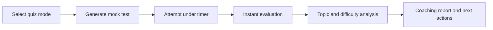

# Level Up Coach

**AI Exam Coach for JEE / Boards**

Level Up Coach is an exam-prep website designed to make students feel more confident before they walk into an exam. Instead of only generating questions, it creates a full feedback loop: generate a mock, attempt it under time pressure, evaluate the answers instantly, and turn the result into clear next steps.

For a hackathon judge, the core idea is simple:

> students do not just need more practice questions, they need faster clarity on what they are weak at, where they lose time, and how to improve before the next exam.

## The Problem

Most practice platforms stop at scorecards.

Students often finish a test knowing only:

- how many they got right
- how many they got wrong

What they still do **not** know is:

- which topic is actually hurting their score
- whether they are losing marks because of concepts or poor time management
- which questions are slowing them down
- what they should do before the next mock

That gap creates anxiety and lowers confidence.

## Our Solution

Level Up Coach turns a mock test into an instant coaching experience.

The website:

- generates a JEE-style Physics mock from curated question-bank data
- supports both a **Chapter Quiz** and a **Full Physics Mix**
- tracks a timed attempt instead of a casual quiz session
- evaluates answers immediately after submission
- identifies weak topics, accuracy trends, and slow questions
- produces an action-oriented report so the student knows what to fix next

## What Makes It Novel

The novelty is not just AI-generated questions.

The novelty is the **confidence loop**:

1. generate a realistic paper
2. capture how the student behaves during the attempt
3. analyze both correctness and timing
4. return instant feedback that feels like a personal coach

This project solves a real student problem:

**helping students feel more confident in the exams they give by providing instant feedback, weakness detection, and a practical next-step plan.**

Unlike a normal quiz app, Level Up Coach focuses on:

- **exam behavior**, not just answer checking
- **confidence building**, not just scoring
- **instant diagnosis**, not delayed manual review
- **targeted improvement**, not generic practice

## How The Website Works



## Key Features

- **Full Physics Mix** for a broader exam-style paper
- **Chapter Quiz** for focused topic revision
- **Timed attempt tracking** to simulate real exam pressure
- **Instant feedback** after submission
- **Topic-wise analysis** to surface weak areas
- **Difficulty-wise breakdown** to show where performance drops
- **Question review with explanations**
- **Action plan** with strengths, weak areas, and recommended practice steps

## Demo Scope

This version is currently optimized for **JEE Physics** and uses a pilot set of pre-ingested topics, including:

- `electrostatics`
- `current-electricity`
- `laws-of-motion`
- `ray-optics`
- `thermodynamics`
- `atomic-physics`

The repository already contains prepared local data for the demo flow, which makes it easier for reviewers to run the project.

## Tech Stack

| Layer | Stack |
|---|---|
| Frontend | Next.js, React, TypeScript |
| Backend | FastAPI, Python |
| AI / Parsing | OpenAI, LlamaParse |
| Data | Local SQLite + local parsed/vector data |
| Use case | JEE Physics mock generation, evaluation, and coaching |

## Project Structure

```text
Level-up-coach/
|-- frontend/        # Next.js website
|-- exam_coach/      # FastAPI backend and exam runtime
|-- scripts/         # ingestion and local server helpers
|-- data/            # parsed data, vector index, question bank, run outputs
|-- docs/            # source PDFs and supporting docs
```

## Setup

### 1. Clone the project

```powershell
git clone <your-repo-url>
cd Level-up-coach
```

### 2. Create the backend environment

```powershell
python -m venv .venv
.\.venv\Scripts\activate
pip install -e .
```

### 3. Add environment variables

Copy `.env.example` to `.env` and add your keys:

```env
LLAMA_CLOUD_API_KEY=your-llama-cloud-api-key
OPENAI_API_KEY=your-openai-api-key
OPENAI_MODEL=gpt-5-mini
```

### 4. Install frontend dependencies

```powershell
cd frontend
npm install
cd ..
```

## Run The Project

You need two terminals.

### Terminal 1: start the backend

```powershell
.\.venv\Scripts\activate
python scripts\run_exam_coach_api.py
```

Backend runs at:

```text
http://127.0.0.1:8000
```

### Terminal 2: start the frontend

```powershell
cd frontend
npm run dev
```

Frontend runs at:

```text
http://localhost:3000
```

## How To Use The Website

1. Open `http://localhost:3000`
2. Choose either **Full Physics Mix** or **Chapter Quiz**
3. Generate a test
4. Attempt the quiz within the timer
5. Submit your answers
6. Review the generated report
7. Use the feedback to identify weak topics and improve before the next exam

## What Judges Should Look For

- the shift from a simple quiz generator to an **AI coaching workflow**
- the way the app combines **question generation + timed attempt + instant evaluation**
- the focus on **student confidence**, not only marks
- the report experience: weak topics, slow questions, review lab, and action plan

## Optional: Rebuild The Content Pipeline

These commands are only needed if you want to rebuild the parsed cache or question bank.

```powershell
.\.venv\Scripts\activate
python scripts\ingest_llamaparse_cache.py
python scripts\ingest_question_bank.py
```

## API Endpoints

The backend currently exposes:

- `GET /health`
- `GET /api/topics`
- `POST /api/exam-coach/generate`
- `POST /api/exam-coach/start-attempt`
- `GET /api/exam-coach/attempt/{attempt_id}`
- `POST /api/exam-coach/evaluate`

## Why This Matters

Level Up Coach is built around one outcome:

**when students receive immediate, understandable feedback after a mock test, they feel more prepared, more in control, and more confident for the real exam.**
